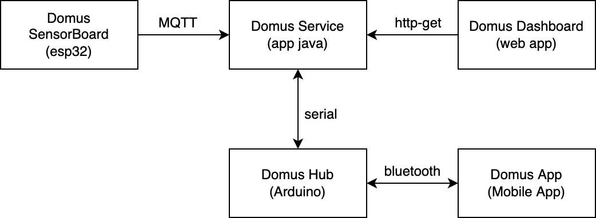

# Domotic Home
Progetto IoT - Unibo

Si pone l'obbiettivo di realizzare un sistema IoT per rendere domotica una abitazione avente luci interne, esterne, un garage con portone motorizzato, un sistema di allarme ed un impianto di riscaldamento.

Il sistema si compone di 5 sottosistemi che comunicano fra di loro:

+ **Sensor Board (esp32)**: sistema embedded che si occupa di misurare la luminosità e la temperatura esterna e di comunicare al Home Service le misurazioni in formato Json via protocollo MQTT.
+ **Domus Service (app java)**: si occupa principalmente di propagare le informazioni ricevute dai diversi componenti. Le misurazioni ricevute in MQTT vengono inviate ad arduino via seriale. Lo stato della abitazione ricevuto via seriale da Domus Hub (Arduino) viene memorizzato e inviato alla Dashboard in formato json.
+ **Domus Hub (arduino)**: controlla lo stato di tutti gli impianti/luci/attuatori presenti nella abitazione. Riceve le misurazioni dei sensori via seriale. Comunica via bluetooth con Domus App (App Mobile Android).
+ **Domus App (Mobile App Android)**: applicazione con la quale è possibile controllare l'illuminazione della abitazione, disattivare/attivare l’allarme, accendere/spegnere il riscaldamento e visualizzare la temperatura impostata. Comunica tramite bluetooth con il Domus Hub.
+ **Domus Dashboard (web app)**: front end per visualizzare una panoramica della abitazione e delle misurazioni dei sensori. Effettua richieste http al Domus Service, ricevendo dati in formato json.

Maggiori dettagli sui requisiti sono forniti in questo documento: [requirements.pdf](./doc/requirements.pdf).

Il report generale del progetto invece è consultabile [qui](./doc/report.pdf).

### Link video dimostrativo: 
[Domotic Home Video](https://liveunibo-my.sharepoint.com/personal/matteo_violani_studio_unibo_it/_layouts/15/stream.aspx?id=%2Fpersonal%2Fmatteo%5Fviolani%5Fstudio%5Funibo%5Fit%2FDocuments%2Fprogetto%20Iot%2FDomotic%20Home%20%2D%20Progetto%20iot%2Emp4&ga=1)

